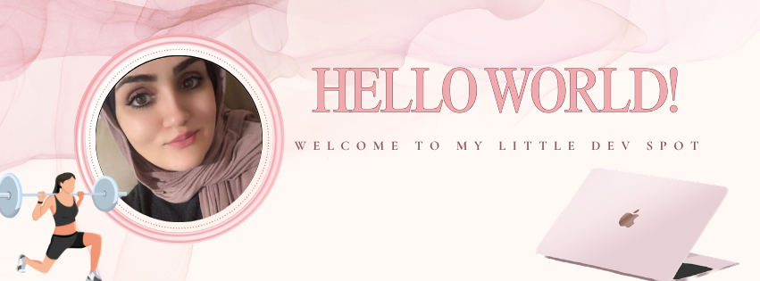

  

 If you came here then you are either my instructor, someone I sent my resumee to, or a random person in passing, to which I have to say that is quite impressive. None the less, welcome. Since you're here and since this is my space I am going to tell you a little bit about myself, if you don't care about that just go through my repos. And yes this will be a lengthy piece because I like to talk about my journey into the compsci universe.

##  My background story

Once upon a time my parents got me a cute little dell laptop which still holds a special place in my memories at the age of 11-12. I took to it very quickly and used it to do all sorts of cool stuff. I wanted to use software that cost hundreds of dollars that I didn't have the money for so then I discovered the world of demonoid.com, thePiratebay and also limewire before it was sadly destroyed. My interests in art, graphic design, and video editing ultimately created the door to which led me into computer science. I was coding before I even knew I was coding. Not from scratch! But I was utilizing html and CSS, not realizing that this was coding to make my own personalized presence in different places in the online world.. I have just been everywhere that I have been allowed to be, and in return I learned so many things.. Like in middle school, whoever was in charge of IT at the time was not doing their job good because I used to use "shutdown -i" on command prompt to force shutdown other students computers in the computer lab. 
Anywho, It's been a mix of things that stemmed from other interests like anime, the desire to learn graphic design, video editing, how to modify my nintendo wii so I could download all the games I want without paying money using the homebrew channel,, and ultimately I could never have done all those fun and possibly not so legal things if I didn't have an aptitude for computers in general. Fast forward to highschool where I found my calling.. by accident! We took a visual basic course and it was very apparent at the very start that I was far too advanced for the course level presented to our class. And because I had a wonderful teacher who was super excited to help me discover my talents, he made me do different assignments apart from the other students and dubbed me "the best programmer in the history of salam school" That was it. I guess I have always been pulled in to this world in one way or another throughout my childhood. It didn't ever occur to me that I would one day be contributing to the computing world, because I just thought really special smart people do that and no way can I do all that but here I am :D and here we are here together in this wonderful world, floating around in space. 

# My Life Currently & Future Goals!

I have completed my degree as of May 2025 I was able to have the honor of being brought on as an Intern with Mumms -- a Hospice company based in New Orleans and got to do a lot of web development. I mainly worked on front-end (since they probably didn't want me to break anything important) and got the opportunity towards the end of my 3 month internship to do backend work with SQL and java. I also got to do some deployments with a senior monitoring me so that I don't mess anything up. During this time sadly my health started to deteriorate so I took a step back and worked extra hard on my health and got into the GYM life and lifting and found a passion I never knew existed. I am currently working on building a website from scratch that is to be a false lash shop. I am finding that I am having so much fun doing this as painfully long as it takes as it allows me complete creative freedom. No pressure of breaking anyone's work because it's all my work, and just having complete control of everything has been so much fun. 

#My Interests

I love working out and lifting weights. I can finally do a neutral grip pull up-- something I have never been able to do
I love finding new things to be busy with , upgrading my self and knowledge
I love cats and baby animals
I have a knack for design but I also have OCD so it takes me forever to come up with a design I like (I intend to so some artwork and attach it here cuz why not????)
Shooter games -- Currently I have been playing every evening around midnight. Sniping is so satisfying
Heavy metal. I like pink things and also heavy metal music especially when I am lifting. Something about it hypes me up! 
I have a deep sick addiction to celcius. I am worried about my kidneys but if I don't have my 200mg can of celcius It's not going to be good
Popcorn. stove popped. Ive been making it everynight since I was 13 and now I have my children addicted to it
Tiktok. I am sorry this might be the dealbreaker. I love passing time on tiktok -- It's where I get my recipes, where I learned different workouts, and where I turn to for quick information / references. My tiktok is @whatthesusu I post mainly workout content
Palestine -- I am gonna be straightforward. I am palestinian I support my people and their freedom for Israeli illegal settlements and occupation. If you support Israel and I gave you my application let's stop here. I won't work for people who blatantly choose to stand with ignorance. 
DId you know todays hebrew is basically a fake language?
I support Congo, Sudan, Kurdistan and all the oppressed peoples in this world. May they become liberated from their oppressors. 

#  Relevant course work

Graduating GPA: 3.4 (I was SO close to a 3.5 I am so sad.)

-  Networking and telecommunications
-  Datastructures and Algorithms
-  Mobile App Development
-  Operating Systems
-  Systems Programming (With C)
-  Assembly programming
-  MIPS assembly Programming
-  Data analytics (Python)
-  Cloud Computing
-  Intro to cybersecurity
-  Intro to AI

* ... And other cs courses that may or may not be as relevant *

Coding Languages I have used and worked with:

- MIPS assembly
- C
- Java
- React
- JSX
- Javascript
- HTML/CSS
- Python
- Visual basic
- Arduino
- Matlab (i don't really count this one but engineers count it as one so what the heck! why not!)

- *I made all the gifs/images in this special space of mine. They were designed specifically for making my github page to be more fun. :D*
  
<!--

**sabdalah/sabdalah** is a ✨ _special_ ✨ repository because its `README.md` (this file) appears on your GitHub profile.

Here are some ideas to get you started:

- 🔭 I’m currently working on ...
- 🌱 I’m currently learning ...
- 👯 I’m looking to collaborate on ...
- 🤔 I’m looking for help with ...
- 💬 Ask me about ...
- 📫 How to reach me: ...
- 😄 Pronouns: ...

-->
